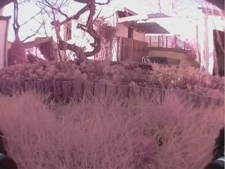
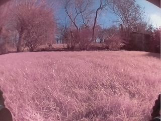

# Data Collection

First we need images to train the model.

To get sure we've images closed to what the rover seess, let's use it's cam !

The data collection is done by mean of two distinct nodes :

 * data_collection.py
 * teleop_key.py

 ## data_collection.py

 This node subscribes to the __/camera/image_raw__ topic and register continuously the image to a private field.

 This node subscribes also to a __/leomower/teleop_key__. When the 'f' char is received the last image is saved to the __dataset/free__ folder, the 'b' char triggers a save of the image to the __dataset/blocked__.

 Run the node in a ssh session:

 ``` bash
 rosrun leomower scripts/data_collection.py
```

## teleop_key.py

This node waits for key strokes and publishes the key to the __/leomower/teleop_key__ topic.

> The package `readkeys` is used by this nodee
> ``` bash
> sudo pip3 install readkeys
> ```

 Run the node in another ssh session:

 ``` bash
 rosrun leomower scripts/teleop_key.py
```

## Shooting

After a roaming session in the garden we returned back with about 120 __blocked__ images and 80 __free__ images like this:

| Blocked      | Free |
| ----------- | ----------- |
|       |        |


And now, time to [Train](train.md)

## Some used references

* https://gist.github.com/rethink-imcmahon/77a1a4d5506258f3dc1f

